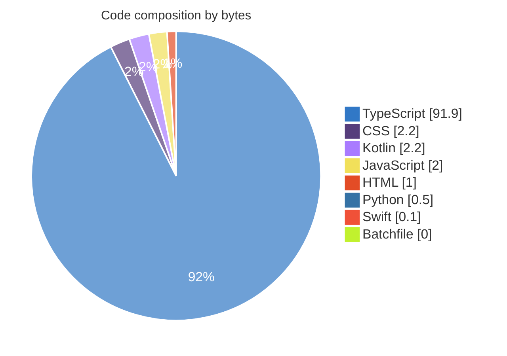

<div align="center">


<a href="https://github.com/Bavly-Hamdy"></a>

<a href="https://github.com/Bavly-Hamdy"></a>

<p align="center">
<a href="https://github.com/Bavly-Hamdy?tab=followers"></a>


</p>

</div>

<br/>

## 🧑‍💻 About Me

Full-Stack Software Engineer & UI/UX Architect | Next.js, TypeScript, React & Node.js. Building modern, high-performance web experiences.. Passionate about clean architecture and impactful open-source engineering.

- 💼 **Focus**: Distributed software architectures
- 🔭 **Working on**: Engagement
- 🌱 **Learning**: Advanced systems performance & scalability
- 💬 **Ask me about**: Software architecture, TypeScript, system design
- 📫 **Reach me**: @Bavly-Hamdy on GitHub
- ⚡ **Fun fact**: I enjoy brewing espresso with measured pressure profiling.

<br/>

## 🛠️ Tech Stack

### 🌐 Languages & Runtimes

<p align="left">


</p>

### 🎨 Frontend & UI Frameworks

<p align="left">


</p>

### ⚙️ Backend & APIs

<p align="left">


</p>

### 📱 Mobile & Cross-Platform

<p align="left">


</p>

### 🗄️ Databases & ORM

<p align="left">


</p>

### ☁️ Cloud, DevOps & Infrastructure

<p align="left">


</p>

### 🧠 AI, Machine Learning & Data

<p align="left">


</p>

### ✨ Design & Prototyping

<p align="left">


</p>

### 🛠️ Tools, Utilities & Platforms

<p align="left">


</p>

<br/>

## 🚀 Featured Projects

| Project | Description | Stack | ⭐ | 🍴 |
| :-- | :-- | :-- | :-: | :-: |
| [**ReadmeForge**](https://github.com/Bavly-Hamdy/ReadmeForge) | Engineering-grade README generator for modern software repositories with AST parsing and visual Mermaid architecture topologies. | `TypeScript` | 2 | 0 |
| [**BOSSLA-CAREER-PRO**](https://github.com/Bavly-Hamdy/BOSSLA-CAREER-PRO) | 🧭 Forensic ATS Resume Auditor, Google X-Y-Z Bullet Rewriter, Keyword Gap Detector & AI Career Co-Pilot powered by Gemini 2.5 Flash. | `TypeScript` | 1 | 0 |
| [**BIS-Smart-Grader-V2**](https://github.com/Bavly-Hamdy/BIS-Smart-Grader-V2) | BIS-Smart-Grader-V2 is a modern web application built with React, TypeScript, and Tailwind CSS, integrated with Firebase for seamless grading and assessment workflows. | `TypeScript` | 1 | 0 |
| [**focusos**](https://github.com/Bavly-Hamdy/focusos) | 🪐 High-performance ambient productivity operating system with diurnal chronotype scheduling, 528Hz Solfeggio soundscape, and OWASP-hardened zero-trust architecture. | `TypeScript` | 1 | 0 |
| [**SinaiConnect**](https://github.com/Bavly-Hamdy/SinaiConnect) | SinaiConnect is a full-stack web application built with React, TypeScript, and Node.js, designed to connect users and streamline communication for Sinai-related services. | `TypeScript` | 1 | 0 |
| [**gitarmor-ai**](https://github.com/Bavly-Hamdy/gitarmor-ai) | Enterprise DevSecOps & AI Security Intelligence Platform powered by Gemini 2.5, featuring automated SAST scanning, live code sandbox remediation, OWASP compliance mapping, and CI/CD security gates. | `TypeScript` | 1 | 0 |
| [**SmartEdu_Platform**](https://github.com/Bavly-Hamdy/SmartEdu_Platform) | SmartEdu Platform | `TypeScript` | 1 | 0 |
| [**Clinic_OS**](https://github.com/Bavly-Hamdy/Clinic_OS) | Clinic OS: A professional, bilingual (AR/EN) clinic management system built with React, Firebase, and Gemini AI. Featuring real-time patient queue, AI-powered drug autocomplete, and glassmorphic UI. | `TypeScript` | 1 | 0 |

<br/>

## 📊 Profile Analytics

> Generated from a full analysis of **34 repositories** and the public activity stream · data as of 2026-10-04

### ⚡ At a Glance

| ⭐ Stars | 🍴 Forks | 📦 Repos | 👥 Followers | 🔥 Contributions | 📅 Years |
| :-: | :-: | :-: | :-: | :-: | :-: |
| **30** | **2** | **34** | **1** | **68** | **4.6** |

### 🧬 Language DNA

```text
TypeScript  ███████████████████████░░   91.9%   18 repos
CSS         █░░░░░░░░░░░░░░░░░░░░░░░░    2.2%   22 repos
Kotlin      █░░░░░░░░░░░░░░░░░░░░░░░░    2.2%   1 repos
JavaScript  █░░░░░░░░░░░░░░░░░░░░░░░░    2.0%   16 repos
HTML        ░░░░░░░░░░░░░░░░░░░░░░░░░    1.0%   20 repos
Python      ░░░░░░░░░░░░░░░░░░░░░░░░░    0.5%   2 repos
Swift       ░░░░░░░░░░░░░░░░░░░░░░░░░    0.1%   1 repos
Batchfile   ░░░░░░░░░░░░░░░░░░░░░░░░░    0.0%   1 repos
```



### 🕰️ Coding Rhythm

```text
Sunday     ░░░░░░░░░░░░░░░░░░░░░░    0.0%
Monday     ██████░░░░░░░░░░░░░░░░   25.0%
Tuesday    ██████░░░░░░░░░░░░░░░░   29.4%
Wednesday  █░░░░░░░░░░░░░░░░░░░░░    4.4%
Thursday   ███░░░░░░░░░░░░░░░░░░░   11.8%
Friday     █░░░░░░░░░░░░░░░░░░░░░    2.9%
Saturday   ██████░░░░░░░░░░░░░░░░   26.5%

🌅 Morning  ██░░░░░░░░░░░░░░░░░░░░    7.4%
☀️ Daytime  ██░░░░░░░░░░░░░░░░░░░░   10.3%
🌆 Evening  █████████████████░░░░░   76.5%
🌙 Night    █░░░░░░░░░░░░░░░░░░░░░    5.9%
```

**🌆 Evening hacker** · Peak: **Tuesday 20:00 UTC**  
<sub>All times in UTC, derived from public activity.</sub>

### 🏆 Developer Scorecard

<div align="center">


</div>

| Dimension | Score | |
| :-- | :-- | --: |
| 🎯 Impact | `██████░░░░░░░░░░░░░░` | **29** |
| 📈 Consistency | `██░░░░░░░░░░░░░░░░░░` | **9** |
| 🧪 Versatility | `██████░░░░░░░░░░░░░░` | **32** |
| 🛠️ Maintenance | `████████████░░░░░░░░` | **62** |
| 🤝 Community | `█░░░░░░░░░░░░░░░░░░░` | **6** |
| 📝 Documentation | `███████░░░░░░░░░░░░░` | **36** |

> 🎨 **Interface Craftsman** — Obsessed with user-facing experience, components and interaction quality.

### 🔥 Contribution Pulse

| Total | Commits | Pull Requests | Issues | Reviews | Current Streak | Longest Streak |
| :-: | :-: | :-: | :-: | :-: | :-: | :-: |
| **68** | **44** | **0** | **0** | **0** | **0 days** | **3 days** |

<sub>🏅 Best Day: **20** — 2026-09-29</sub>

### 🗓️ Shipping Timeline

```text
2022  ██░░░░░░░░░░░░░░░░░░░░░░░░░░░░  1
2024  ██████████░░░░░░░░░░░░░░░░░░░░  6
2025  ███████████████░░░░░░░░░░░░░░░  9
2026  ██████████████████████████████  18
```

### 🏷️ Recurring Themes

               

### 💡 Key Insights

- 🧬 TypeScript is the dominant language — 91.9% of analysed code across 18 repositories.
- ⭐ Earned 30 stars and 2 forks; "Engagement" alone holds 17% of all stars.
- 🕰️ Most productive on Tuesdays around 20:00 UTC — an evening hacker.
- 🔥 68 contributions over the last 90 days, active on 8 days with a 3-day best streak.
- 📅 4.6 years on GitHub, shipping 34 original repositories (~7.4/year).
- 🛠️ 53% of original repositories were updated in the last 6 months.
- 🏷️ Recurring themes: typescript, tailwindcss, react, framer-motion.
- ⚖️ Preferred license: MIT (7 repos).

<br/>

## 📈 GitHub Metrics

<div align="center">


</div>

<br/>

## 🤝 Connect

<div align="center">

Always open to discussing exciting technical projects and open-source contributions.

<a href="https://github.com/Bavly-Hamdy"></a>
<a href="https://linkedin.com/in/www.linkedin.com/in/bavly-hamdy"></a>
<a href="mailto:bavly.hamdy@gmail.com"></a>

</div>

<br/>

---

<div align="center">

<sub>⭐️ Designed with care by <a href="https://github.com/Bavly-Hamdy">@Bavly-Hamdy</a> · Crafted with README Studio</sub>

</div>